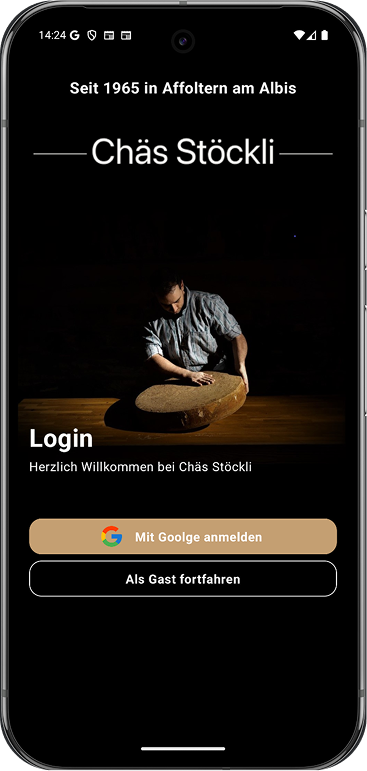
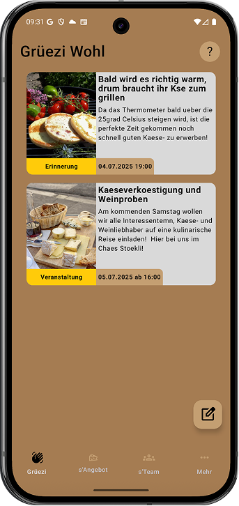
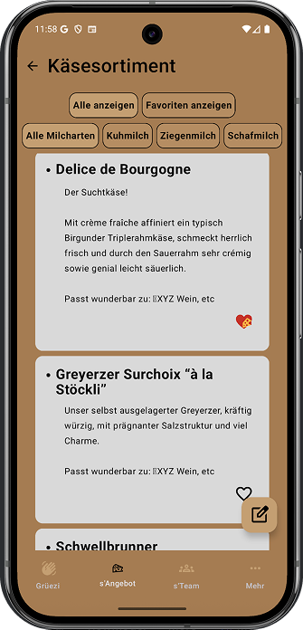
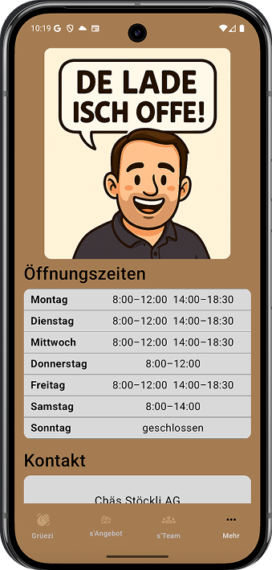

# Chäs Stöckli - Wenn Käse der Himmel wäre 🧀

Chäs Stöckli bietet eine Plattform in der sich Kunden über das vorhandene Käseangebot informieren können **bevor**
Sie den Laden betreten. 
 
Diese App richtet sich an alle Käseliebhaber in der Schweiz um Affoltern am Albis und darüber hinaus!

## Design 🎨

  
  
  
  

## Features ✅

- ✅ Informationsfindung über das Käse- und sonstige Sortiment.
- ✅ Favorisierung von Käsesorten
- ✅ Filterung per Kategorien(zb Käse aus Ziegen- oder Kuhmilch) und nach Favoriten
- ✅ Integration von Google Maps zur Wegfindung.

## Technischer Aufbau 🔧

- **MVVM-Architektur**
  - `ui/` enthält Composables und Screens
  - `viewmodel/` für ViewModel-Klassen
  - `data/` mit Repositories, RemoteDataSource (API) und LocalDataSource (Firebase)
  - `di/` für die  **Dependency Injection** mit Koin 

#### Datenspeicherung

- 🔄 **Firebase Firestore** für alle persistenten Event- ,Nutzer- und Käsedaten (offline-fähig, automatische Synchronisation)
- 🔐 **Firebase Authentication** für die Authentifizierung von Anonymen und Googlenutzern
- 🖼️ **Firebase Cloud Storage** für Bilder und Medieninhalte von Events

#### API Calls

- 📍 Google Directions API für die Routenberechnung zum Laden
- 📍 Google Static Maps API zum anzeigen einer Karte mit Route

#### 3rd-Party Frameworks

- 💎 **Jetpack Compose** für UI
- 🔀 **Navigation Compose** für Bildschirm-Navigation
- ❄️ **Koin** für Dependency Injection
- 🔄 **Kotlin Coroutines** & **Flow** für Asynchronität und Datenströme
- 🧠 **ViewModel (Lifecycle)** zur Zustandshaltung
- 🌐 **Retrofit** & **OkHttp** für Netzwerk-Anfragen
- 🖼️ **Coil** zum asynchronen Laden von Bildern
- 🔥 **Firebase** für:
  - Authentifizierung (Google Sign-In)
  - Cloud Firestore (Datenhaltung)
  - Cloud Storage (Bilder)
- 📦 **Material Icons** für intuitive UI-Symbole

