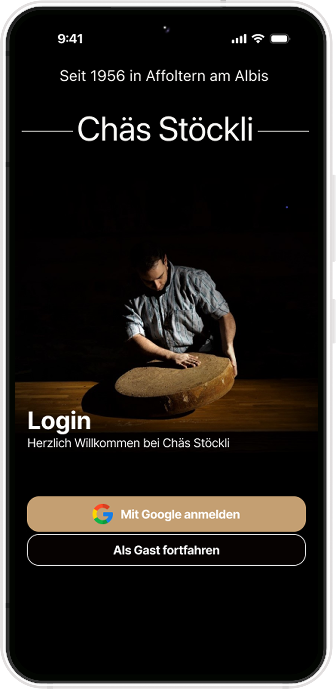
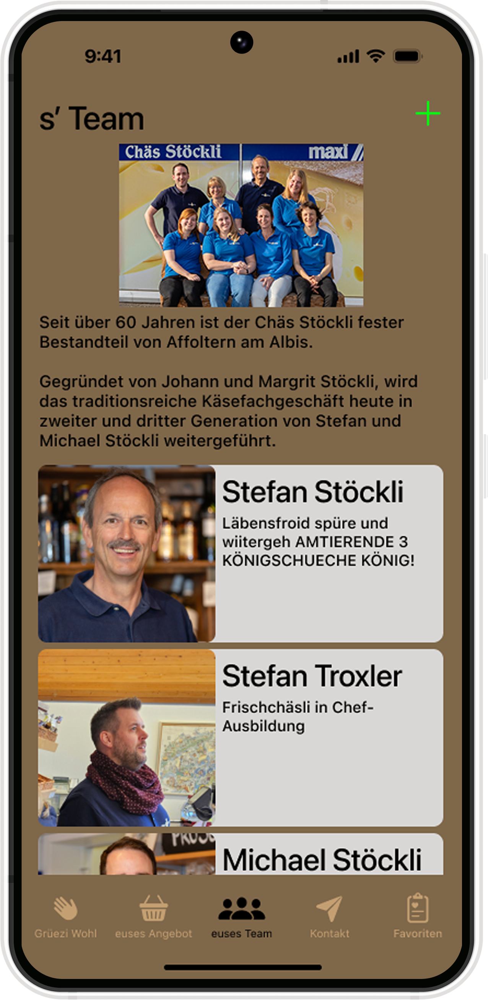
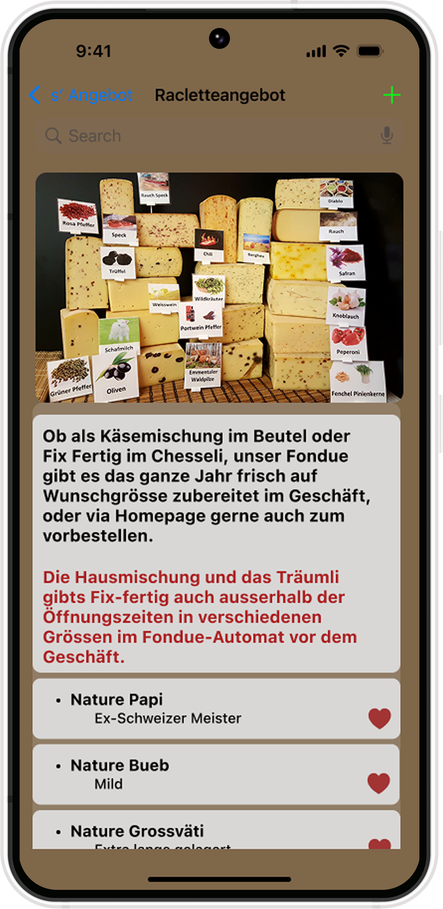
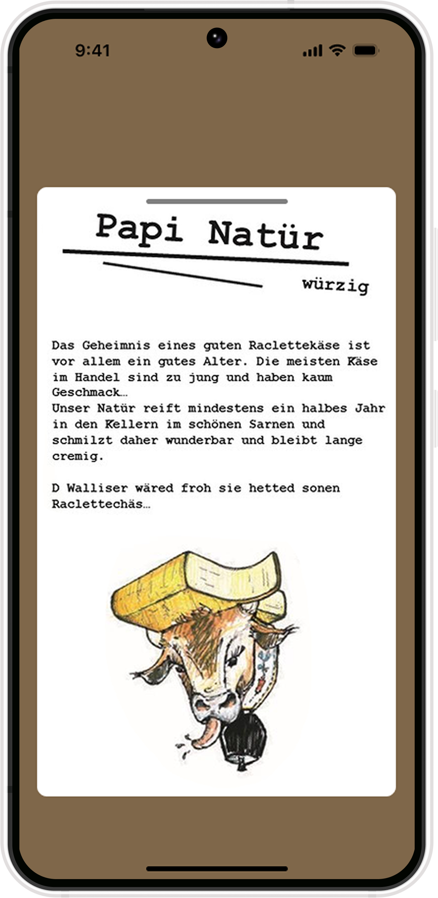

# Chäs Stöckli - Wenn Käse der Himmel wäre 🧀

Chäs Stöckli bietet eine Plattform in der sich Kunden über das vorhandene Käseangebot informieren können **bevor**
Sie den Laden betreten. 
 
Diese App richtet sich an alle Käseliebhaber in der Schweiz um Affoltern am Albis und darüber hinaus!

## Design 🎨

  
  
  
  

## Features ✅

- [ ] Informationsfindung über das Käse- und sonstige Sortiment.
- [ ] Suche per Kategorien(zb Käse aus Ziegen- oder Kuhmilch) oder Name.
- [ ] Integration von Google Maps zur Wegfindung.
- [ ] Veranstaltungen und deren Eintragung in lokale Kalenderapps
- [ ] Favorisierung von Käsesorten
- [ ] Pushbenachrichtigung bei neuen Events oder einem aktuallisiertem Angebot

## Technischer Aufbau 🔧

- **MVVM-Architektur**
  - `ui/` enthält Composables und Screens
  - `viewmodel/` für ViewModel-Klassen
  - `data/` mit Repositories, RemoteDataSource (API) und LocalDataSource (Firebase)
  - `di/` für die  **Dependency Injection** mit Koin 

#### Projektaufbau

#### Datenspeicherung

- 🔄 **Firebase Firestore** für alle persistenten Event- ,Nutzer- und Käsedaten (offline-fähig, automatische Synchronisation)
- 🔐 **Firebase Authentication** für individuelle Nutzer- und Adminaccounts 
- 🖼️ **Firebase Cloud Storage** für Bilder und Medieninhalte von Events

#### API Calls

- 📍 **Google Maps  / Google Directions API** für die Routenberechnung zum Laden

#### 3rd-Party Frameworks

- 💎 **Jetpack Compose** für UI
- ✳️ **Koin** für Dependency Injection
- 🌐 **Retrofit & OkHttp** für Netzwerk-Anfragen
- 🖼️ **Coil** zum asynchronen Laden von Bildern

